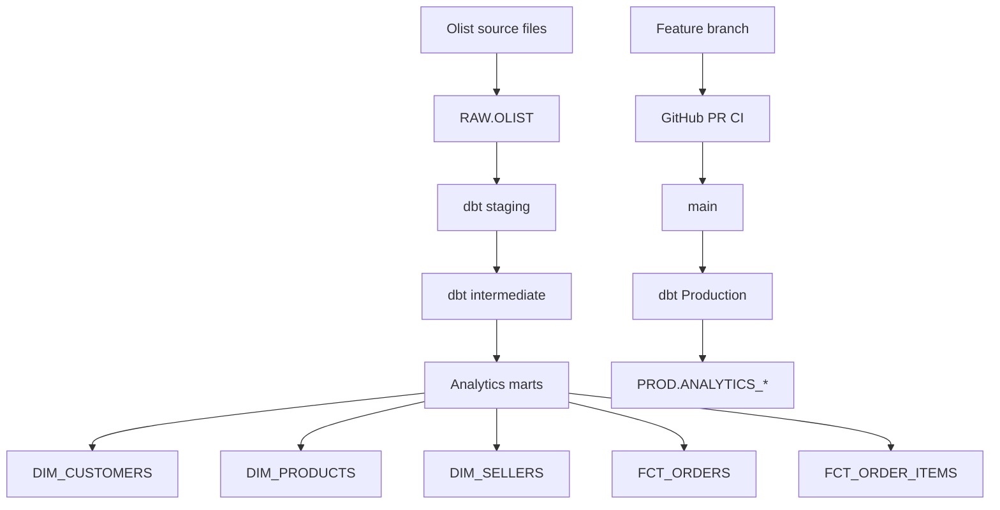

# Olist Analytics

A production-oriented analytics engineering project built with **Snowflake**, **dbt Cloud**, **GitHub**, **SQL**, and the **Brazilian E-Commerce Public Dataset by Olist**.

This project demonstrates an end-to-end workflow from raw source data through layered dbt transformations into tested dimensional marts, with separate development and production environments, incremental processing, CI, role-based access control, key-pair authentication, and scheduled production orchestration.

## Project Status

**Production deployment: complete and validated.**

The hardened pipeline is deployed to the production environment and runs with:

```text
DBT_USER / DBT_ROLE → DBT_PROD_WH
```

Production models are separated into:

```text
PROD.ANALYTICS_STAGING
PROD.ANALYTICS_INTERMEDIATE
PROD.ANALYTICS_MARTS
```

The production dbt job runs `dbt build` on a 12-hour schedule.

## Technology Stack

| Technology | Purpose |
|---|---|
| Snowflake | Cloud data warehouse and compute |
| dbt Cloud | Transformation, testing, deployment, and orchestration |
| GitHub | Version control, pull requests, and CI |
| SQL | Data transformation and dimensional modeling |
| Kaggle / Olist | Public source dataset |

## Dataset

The RAW layer contains nine Olist source tables.

| Source | Rows |
|---|---:|
| Orders | 99,441 |
| Order Items | 112,650 |
| Customers | 99,441 |
| Order Payments | 103,886 |
| Order Reviews | 99,224 |
| Products | 32,951 |
| Sellers | 3,095 |
| Geolocation | 1,000,163 |
| Product Category Translation | 71 |

Each RAW table carries a persistent `_LOADED_AT` ingestion timestamp used to create downstream `record_loaded_at` watermarks for incremental processing.

## Architecture



### Snowflake environment layout

```text
RAW
└── OLIST

DEV
├── DBT_DEV_STAGING
├── DBT_DEV_INTERMEDIATE
└── DBT_DEV_MARTS

PROD
├── ANALYTICS_STAGING
├── ANALYTICS_INTERMEDIATE
└── ANALYTICS_MARTS
```

Development and production use separate compute:

```text
DEV_USER / DEV_ROLE → DEV_WH
DBT_USER / DBT_ROLE → DBT_PROD_WH
```

## dbt Modeling Layers

### Staging

Nine staging models clean and standardize the RAW sources while preserving source grain and propagating `_loaded_at` metadata.

```text
stg_customers
stg_orders
stg_order_items
stg_order_payments
stg_order_reviews
stg_products
stg_sellers
stg_geolocation
stg_product_category_name_translation
```

All transformation SQL uses explicit column selection rather than `SELECT *`.

### Intermediate

Reusable enrichment and aggregation models protect grain before one-to-many datasets are joined into order-level outputs.

```text
int_order_items_enriched
int_order_items_aggregated
int_order_payments_aggregated
int_order_reviews_aggregated
int_orders_enriched
```

### Analytics Marts

The mart layer contains three dimensions and two transactional facts:

```text
dim_customers
dim_products
dim_sellers
fct_orders
fct_order_items
```

`fct_orders` is one row per order. `fct_order_items` is one row per `(order_id, order_item_id)` and provides the correct transactional relationship to product and seller dimensions.

## Production Validation

The deployed production marts were validated after the hardened release.

```text
FCT_ORDERS
99,441 rows
99,441 distinct order IDs
0 duplicate order IDs

FCT_ORDER_ITEMS
112,650 rows
112,650 distinct order-item keys
0 duplicate (order_id, order_item_id) combinations

record_loaded_at nulls
0 in both facts
```

The post-deployment checks are stored in:

```text
setup/03_post_deployment_validation.sql
```

## Incremental Processing

Both fact tables use Snowflake `MERGE` through dbt incremental materializations.

```text
RAW._LOADED_AT
      ↓
staging._loaded_at
      ↓
intermediate.record_loaded_at
      ↓
incremental MERGE
```

`fct_orders` uses `order_id` as its unique key. `fct_order_items` uses the composite key `(order_id, order_item_id)`.

The watermark predicate uses `>=` against the current maximum so rows from the same ingestion batch can be safely reprocessed while the merge keys prevent duplication.

## Data Quality Testing

Testing covers RAW, staging, intermediate, and mart layers.

Structural tests include `not_null`, `unique`, `relationships`, and `accepted_values`. Singular tests also validate model grain and non-negative commercial values.

Known Olist anomalies are surfaced with warning-level tests for timestamp sequencing and payment-versus-order-value reconciliation so they remain visible without unnecessarily blocking deployment.

## Pull-Request CI

GitHub Actions runs dbt project parsing and graph validation for pull requests targeting `main` through:

```text
.github/workflows/dbt-project-ci.yml
```

This catches broken references, malformed Jinja, and project-configuration errors before merge without exposing Snowflake credentials.

## Security and Access Control

Production uses `DBT_USER` with `DBT_ROLE` and encrypted RSA key-pair authentication. Credentials and private-key files are excluded from source control.

A separate `ANALYTICS_READER_ROLE` provides read-only access to production marts so analytics consumers do not require transformation privileges.

## Production Deployment

The production-hardening release introduced five major improvements:

1. Added `fct_order_items` to complete the transactional star schema.
2. Replaced the purchase-date lookback with persistent ingestion watermarks.
3. Added pull-request CI.
4. Added separate DEV/PROD warehouses and layered schemas.
5. Expanded tests and observability checks.

The migration was validated in DEV before merge, deployed through the dbt production environment, and then verified in Snowflake using the post-deployment validation script.

## Project Structure

```text
olist-analytics/
├── .github/workflows/
│   └── dbt-project-ci.yml
├── docs/
│   └── production_hardening_runbook.md
├── models/
│   ├── staging/
│   ├── intermediate/
│   └── marts/
├── setup/
│   ├── 01_snowflake_hardening.sql
│   ├── 02_raw_ingestion_metadata.sql
│   └── 03_post_deployment_validation.sql
├── tests/
├── dbt_project.yml
└── README.md
```

## Engineering Decisions

- Explicit columns instead of `SELECT *`.
- Separate staging, intermediate, and mart layers.
- Protect grain before joining one-to-many datasets.
- Maintain both order-grain and order-item-grain facts.
- Use ingestion-based incremental watermarks rather than business-event dates.
- Keep DEV and PROD compute isolated.
- Use key-pair authentication for the production service identity.
- Provide a read-only consumer role for production marts.
- Treat clustering as evidence-driven optimization rather than default configuration.
- Validate changes through feature branches and pull-request CI before production deployment.

## Current Limitation / Next Step

The Olist source is a static historical dataset. The watermark mechanism is implemented, but automated RAW ingestion is not yet running. Source freshness is therefore configured but should not be used as a blocking production check until ingestion is automated.

Potential extensions include Snowpipe or object-storage ingestion, warehouse-backed dbt Slim CI, snapshots/SCDs, a date dimension, a semantic layer, BI dashboards, and warehouse cost monitoring.

## Skills Demonstrated

**Analytics Engineering · Snowflake · dbt · SQL · Dimensional Modeling · Incremental MERGE · Ingestion Watermarks · Data Quality Testing · GitHub Actions · Production Deployment · RBAC · RSA Key-Pair Authentication · Workload Isolation · Pipeline Orchestration**
