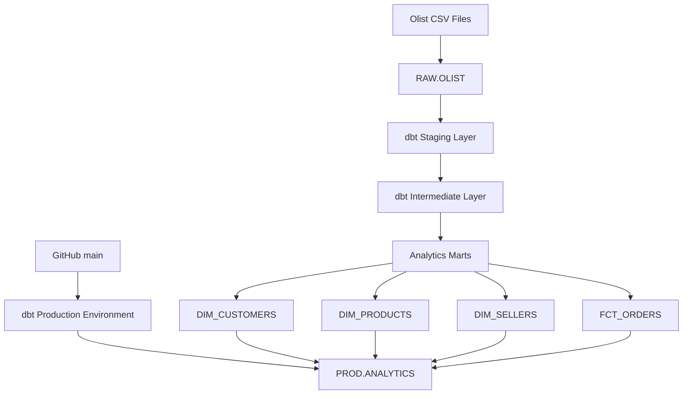

# Analytics Engineering with Snowflake & dbt

An end-to-end analytics engineering project built with **Snowflake**, **dbt Cloud**, **GitHub**, and the **Brazilian E-Commerce Public Dataset by Olist**.

This project demonstrates how raw operational data can be transformed into tested, production-ready analytics models using modern analytics engineering practices.

## Project Overview

The project was designed to simulate a real analytics engineering workflow rather than simply build a collection of SQL queries.

It includes:

- Separate RAW, DEV, and PROD Snowflake environments
- Role-based access control for development and production
- dbt staging, intermediate, and mart layers
- Dimensional data modeling
- Incremental fact-table processing using Snowflake `MERGE`
- Automated data-quality testing
- Git feature-branch and pull-request workflow
- Separate dbt development and production environments
- Secure production service-account authentication using an RSA key pair
- Scheduled production orchestration every 12 hours

## Technology Stack

| Technology | Purpose |
|---|---|
| Snowflake | Cloud data warehouse |
| dbt Cloud | Transformation, testing, deployment, and orchestration |
| GitHub | Version control and pull-request workflow |
| SQL | Data transformation and analytical modeling |
| Kaggle / Olist | Source dataset |

## Dataset

The project uses the **Brazilian E-Commerce Public Dataset by Olist**.

The RAW layer contains nine source tables:

- Customers
- Orders
- Order Items
- Order Payments
- Order Reviews
- Products
- Sellers
- Geolocation
- Product Category Name Translation

Example source volumes:

| Source | Rows |
|---|---:|
| Orders | 99,441 |
| Order Items | 112,650 |
| Customers | 99,441 |
| Order Payments | 103,886 |
| Order Reviews | 99,224 |
| Products | 32,951 |
| Sellers | 3,095 |
| Geolocation | 1,000,163 |
| Product Category Translation | 71 |

## Architecture



The Snowflake warehouse is separated into three databases:

```text
RAW
└── Original source data

DEV
└── DBT_DEV schema for development transformations

PROD
└── ANALYTICS schema for production models
```

## dbt Modeling Layers

### 1. Staging

The staging layer provides a clean and consistent interface over the RAW source data.

Models:

```text
stg_customers
stg_orders
stg_order_items
stg_order_payments
stg_order_reviews
stg_products
stg_sellers
stg_geolocation
stg_product_category_name_translation
```

Responsibilities include:

- Column standardization
- String cleaning and normalization
- Source-column renaming
- Category normalization
- Preserving source grain
- Preparing data for downstream transformations

Explicit column selection is used throughout the project instead of `SELECT *`.

### 2. Intermediate

The intermediate layer contains reusable joins, aggregations, and business logic.

Models:

```text
int_order_items_enriched
int_order_items_aggregated
int_order_payments_aggregated
int_order_reviews_aggregated
int_orders_enriched
```

Examples of transformations:

- Enriching order items with product and seller information
- Translating product categories
- Calculating merchandise, freight, and total item values
- Aggregating payments to order grain
- Aggregating reviews to order grain
- Calculating delivery duration
- Calculating delivery delays

This layer protects downstream model grain by aggregating one-to-many relationships before they are joined to order-level data.

### 3. Analytics Marts

The final analytics layer contains business-facing dimensions and facts.

#### `dim_customers`

**Grain:** one row per unique customer.

Includes:

- Latest known customer location
- First order timestamp
- Latest order timestamp
- Number of customer records

#### `dim_products`

**Grain:** one row per product.

Includes:

- Portuguese product category
- English product category
- Product dimensions
- Product weight
- Product description metadata

#### `dim_sellers`

**Grain:** one row per seller.

Contains seller geographic attributes.

#### `fct_orders`

**Grain:** one row per order.

Contains:

- Customer identifier
- Order status
- Order lifecycle timestamps
- Item counts
- Product and freight values
- Payment metrics
- Review metrics
- Delivery duration
- Delivery delay

## Incremental Processing

`fct_orders` is configured as an incremental dbt model using Snowflake's `MERGE` strategy.

```sql
{{ config(
    materialized='incremental',
    unique_key='order_id',
    incremental_strategy='merge',
    on_schema_change='sync_all_columns'
) }}
```

The first execution performs a full initial load. Later executions reprocess a recent lookback window and merge records using `order_id`.

This allows:

- New orders to be inserted
- Recently changed orders to be updated
- Existing orders to remain unique

Production validation confirmed:

```text
99,441 total rows
99,441 distinct order IDs
0 duplicate orders
```

### Incremental Design Limitation

The Olist source is a static historical dataset and does not contain a reliable ingestion timestamp or source-level `updated_at` field.

A lookback-window approach is therefore used for this project. In a production ingestion system, the preferred incremental watermark would be based on a field such as:

```text
ingested_at
updated_at
CDC timestamp
```

## Snowflake Micro-Partitioning and Clustering

Snowflake automatically organizes table data into **micro-partitions**, so an explicit `PARTITION BY` configuration is not required as it would be on some other cloud warehouses.

No manual clustering key was added to `fct_orders`.

This was intentional. At roughly 100,000 orders, maintaining a clustering key would add unnecessary compute cost without a meaningful performance benefit.

For a significantly larger fact table, clustering could be evaluated using query profiles and partition-pruning metrics before adding a configuration such as:

```python
cluster_by=['order_purchase_timestamp']
```

## Data Quality Testing

Testing is implemented at multiple layers.

### Source tests

RAW source data is validated for:

- `not_null`
- `unique`
- Required identifiers

### Staging tests

The staging layer includes:

- Primary-key uniqueness
- Non-null checks
- Accepted values
- Relationship tests

### Mart tests

Analytics marts include:

- Dimension-key uniqueness
- Order uniqueness
- Customer relationships
- Accepted order statuses

### Custom Grain Test

A custom singular dbt test ensures that the combination below remains unique in the order-item dataset:

```text
order_id + order_item_id
```

The test passes only when no duplicate composite keys are returned.

## Security & Access Control

Development and production use separate Snowflake identities.

### Development

```text
DEV_USER
   ↓
DEV_ROLE
   ↓
DEV.DBT_DEV
```

### Production

```text
DBT_USER
   ↓
DBT_ROLE
   ↓
PROD.ANALYTICS
```

`DBT_USER` is configured as a Snowflake service user.

Production authentication uses an encrypted RSA key pair instead of username/password authentication. The private key is stored outside the Git repository and is never committed to source control.

## Git Workflow

Development follows a feature-branch workflow:

```text
Feature branch
     ↓
Development and testing
     ↓
Pull Request
     ↓
Merge to main
     ↓
Production deployment
```

The transformation pipeline was developed and tested in DEV before being merged into `main` through GitHub.

## Production Deployment

A dedicated dbt Cloud production environment connects to:

```text
Database: PROD
Schema: ANALYTICS
Role: DBT_ROLE
User: DBT_USER
```

The production deployment job is named:

```text
Olist Production Build
```

It executes:

```bash
dbt build
```

Using `dbt build` ensures that model execution and associated data-quality tests run as part of the same production workflow.

The production pipeline was successfully executed multiple times, including validation of the incremental `fct_orders` behavior.

## Orchestration

The production dbt job is scheduled to execute **every 12 hours**.

```text
Scheduled trigger
      ↓
dbt build
      ↓
Read RAW.OLIST
      ↓
Refresh staging models
      ↓
Refresh intermediate models
      ↓
Build dimensions
      ↓
Incrementally MERGE FCT_ORDERS
      ↓
Run data-quality tests
      ↓
PROD.ANALYTICS
```

Because the Olist dataset is static, the 12-hour schedule is primarily used to demonstrate production orchestration. In a live system, job frequency would normally be aligned with source-data arrival frequency and business SLAs.

## Project Structure

```text
analytics-engineering-snowflake-dbt/
│
├── models/
│   ├── staging/
│   │   ├── _sources.yml
│   │   ├── _staging.yml
│   │   ├── stg_customers.sql
│   │   ├── stg_orders.sql
│   │   ├── stg_order_items.sql
│   │   ├── stg_order_payments.sql
│   │   ├── stg_order_reviews.sql
│   │   ├── stg_products.sql
│   │   ├── stg_sellers.sql
│   │   ├── stg_geolocation.sql
│   │   └── stg_product_category_name_translation.sql
│   │
│   ├── intermediate/
│   │   ├── int_order_items_enriched.sql
│   │   ├── int_order_items_aggregated.sql
│   │   ├── int_order_payments_aggregated.sql
│   │   ├── int_order_reviews_aggregated.sql
│   │   └── int_orders_enriched.sql
│   │
│   └── marts/
│       ├── _marts.yml
│       ├── dim_customers.sql
│       ├── dim_products.sql
│       ├── dim_sellers.sql
│       └── fct_orders.sql
│
├── tests/
│   └── assert_unique_order_item_grain.sql
│
├── dbt_project.yml
└── README.md
```

## Engineering Decisions

1. **Explicit columns instead of `SELECT *`**  
   Makes schemas easier to control and prevents unexpected upstream changes from silently propagating.

2. **Separate staging and intermediate layers**  
   Keeps source cleaning separate from reusable business logic.

3. **Protect model grain before joining**  
   One-to-many tables such as payments and reviews are aggregated before being joined to the order-level model.

4. **Incremental fact model**  
   Demonstrates scalable processing while dimensions remain straightforward table materializations.

5. **No unnecessary Snowflake clustering**  
   Performance configuration is based on expected workload and data volume rather than added without evidence.

6. **Separate DEV and PROD identities**  
   Production jobs do not run using a developer's personal credentials.

7. **Key-pair authentication**  
   Production service authentication avoids password-based access.

8. **Automated testing in deployment**  
   `dbt build` ensures model construction and data-quality validation are part of the production job.

## Future Improvements

Potential next steps include:

- Automated ingestion from cloud object storage
- Ingestion timestamps for more reliable incremental processing
- Source freshness monitoring
- dbt snapshots / Slowly Changing Dimensions
- A `fct_order_items` mart for product and seller analysis at item grain
- Pull-request CI checks
- BI dashboard development using the analytics marts
- Warehouse cost and query-performance monitoring
- Alerting for failed production jobs and data-quality tests

## Key Skills Demonstrated

This project demonstrates practical experience with:

- Analytics Engineering
- Snowflake
- dbt
- SQL
- Dimensional Modeling
- Incremental Data Pipelines
- Data Quality Testing
- Git & GitHub
- Production Deployment
- Role-Based Access Control
- RSA Key-Pair Authentication
- Data Warehouse Architecture
- Pipeline Orchestration
