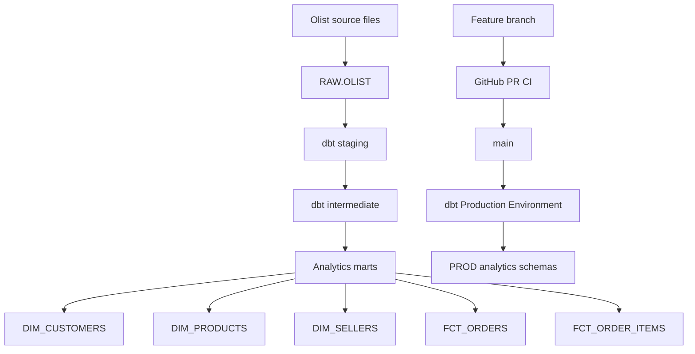

# Analytics Engineering with Snowflake & dbt

An end-to-end analytics engineering project built with **Snowflake**, **dbt Cloud**, **GitHub**, and the **Brazilian E-Commerce Public Dataset by Olist**.

This project demonstrates a production-oriented workflow: environment separation, layered dbt modeling, dimensional marts, incremental processing, automated testing, pull-request validation, role-based security, RSA key-pair authentication, and scheduled orchestration.

## Production Status

**Deployed and validated in Production.**

The hardened production pipeline has been successfully deployed to Snowflake and validated end to end.

| Check | Result |
|---|---:|
| `FCT_ORDERS` rows | 99,441 |
| Distinct order IDs | 99,441 |
| `FCT_ORDER_ITEMS` rows | 112,650 |
| Distinct order-item keys | 112,650 |
| Duplicate `(order_id, order_item_id)` rows | 0 |
| Null order watermarks | 0 |
| Null order-item watermarks | 0 |
| Production schedule | Every 12 hours |

Production runs with `DBT_USER` / `DBT_ROLE` on the dedicated `DBT_PROD_WH` warehouse. Development uses `DEV_USER` / `DEV_ROLE` on `DEV_WH`.

## Project Overview

The pipeline is designed around five engineering goals:

- keep raw data separate from transformation environments,
- preserve model grain and business logic through clear dbt layers,
- use incremental processing for transactional facts,
- validate code and data automatically before and after deployment,
- isolate development, production, and analytics-consumer access.

## Technology Stack

| Technology | Purpose |
|---|---|
| Snowflake | Cloud data warehouse |
| dbt Cloud | Transformation, testing, deployment, and orchestration |
| GitHub | Version control, pull requests, and CI |
| SQL | Data transformation and analytical modeling |
| Kaggle / Olist | Public source dataset |

## Dataset

The RAW layer contains nine Olist source tables.

| Source | Rows |
|---|---:|
| Orders | 99,441 |
| Order Items | 112,650 |
| Customers | 99,441 |
| Order Payments | 103,886 |
| Order Reviews | 99,224 |
| Products | 32,951 |
| Sellers | 3,095 |
| Geolocation | 1,000,163 |
| Product Category Translation | 71 |

Each RAW table carries a persistent `_LOADED_AT` ingestion timestamp. That metadata provides a warehouse-level watermark for incremental processing and future source-freshness monitoring.

## Architecture



### Snowflake environment layout

```text
RAW
└── OLIST

DEV
├── DBT_DEV_STAGING
├── DBT_DEV_INTERMEDIATE
└── DBT_DEV_MARTS

PROD
├── ANALYTICS_STAGING
├── ANALYTICS_INTERMEDIATE
└── ANALYTICS_MARTS
```

Development and production use separate warehouses:

```text
DEV_USER / DEV_ROLE  → DEV_WH
DBT_USER / DBT_ROLE  → DBT_PROD_WH
```

This separates compute consumption as well as databases, schemas, identities, and permissions.

## dbt Modeling Layers

### 1. Staging

The staging layer provides a clean interface over RAW data while preserving source grain.

```text
stg_customers
stg_orders
stg_order_items
stg_order_payments
stg_order_reviews
stg_products
stg_sellers
stg_geolocation
stg_product_category_name_translation
```

Responsibilities include string cleaning, column standardization, source-column renaming, category normalization, and propagation of `_loaded_at` ingestion metadata.

Explicit column selection is used instead of `SELECT *`.

### 2. Intermediate

The intermediate layer contains reusable joins and order-level aggregations.

```text
int_order_items_enriched
int_order_items_aggregated
int_order_payments_aggregated
int_order_reviews_aggregated
int_orders_enriched
```

Key logic includes:

- product, seller, and category enrichment,
- merchandise and freight calculations,
- payment aggregation to order grain,
- review aggregation to order grain,
- delivery-duration and delay calculations,
- propagation of a downstream `record_loaded_at` watermark.

One-to-many datasets are aggregated before being joined to order-level models so downstream grain is protected.

### 3. Analytics Marts

#### `dim_customers`

**Grain:** one row per unique customer.

Contains latest known customer location and customer lifecycle timestamps.

#### `dim_products`

**Grain:** one row per product.

Contains translated category attributes and product dimensions.

#### `dim_sellers`

**Grain:** one row per seller.

Contains seller location attributes.

#### `fct_orders`

**Grain:** one row per order.

Contains order lifecycle timestamps, delivery metrics, item aggregates, payment metrics, review metrics, and `record_loaded_at`.

Validated production baseline:

```text
99,441 rows
99,441 distinct order IDs
0 duplicate order IDs
```

#### `fct_order_items`

**Grain:** one row per `(order_id, order_item_id)`.

This fact links the transactional model to `dim_customers`, `dim_products`, and `dim_sellers`. It contains product and seller keys, order/customer keys, item price, freight value, total item value, order date/status, and the ingestion watermark.

Validated production baseline:

```text
112,650 order-item rows
112,650 distinct order-item keys
0 duplicate (order_id, order_item_id) combinations
```

## Incremental Processing

Both transactional facts use Snowflake `MERGE` through dbt incremental materializations.

`fct_orders` uses `order_id` as its unique key. `fct_order_items` uses the composite key `order_id + order_item_id`.

The incremental predicate is based on persistent ingestion metadata rather than business event date:

```text
RAW._LOADED_AT
      ↓
staging._loaded_at
      ↓
intermediate.record_loaded_at
      ↓
incremental MERGE
```

This is safer than filtering only on `order_purchase_timestamp`, because an older order can still be reprocessed when its source record is loaded or changed later.

The incremental predicate deliberately includes the current maximum watermark (`>=`) so rows sharing the same batch timestamp can be safely reprocessed and merged without duplication.

## Data Quality Testing

Testing covers RAW, staging, intermediate, and mart layers.

**Structural tests**
- `not_null`
- `unique`
- `relationships`
- `accepted_values`

**Grain tests**
- staging order-item composite grain
- intermediate one-row-per-order aggregates
- mart order-item composite grain

**Business-rule tests**
- commercial values cannot be negative
- timestamp anomalies are surfaced as warnings
- payment/order-value reconciliation differences are surfaced as warnings

Warning-level anomaly tests make unusual business records visible without unnecessarily blocking deployment.

## Pull-Request CI

The repository includes `.github/workflows/dbt-project-ci.yml`.

Every pull request targeting `main` automatically runs dbt project parsing and graph validation. This catches invalid project configuration, broken Jinja/dbt references, and malformed project structure before merge without exposing Snowflake credentials.

## Security & Access Control

### Development

```text
DEV_USER
   ↓
DEV_ROLE
   ↓
DEV_WH
   ↓
DEV.DBT_DEV_*
```

### Production

```text
DBT_USER
   ↓
DBT_ROLE
   ↓
DBT_PROD_WH
   ↓
PROD.ANALYTICS_*
```

Production uses encrypted RSA key-pair authentication rather than a password. Private keys and local credential files are excluded from source control.

A separate `ANALYTICS_READER_ROLE` provides read-only access to production marts so BI and analytics consumers do not need transformation privileges.

## Git Workflow

```text
Feature branch
     ↓
Development + tests
     ↓
Pull Request
     ↓
GitHub dbt CI
     ↓
Review / validation
     ↓
main
     ↓
dbt production deployment
```

The production-hardening changes were developed on a feature branch, validated in DEV, reviewed through PR #3, merged to `main`, and then deployed to Production.

## Production Deployment & Orchestration

The production dbt job runs:

```bash
dbt build
```

and is scheduled every 12 hours.

The hardened deployment uses `DBT_USER`, `DBT_ROLE`, RSA key-pair authentication, `DBT_PROD_WH`, and the layered `PROD.ANALYTICS_*` schemas.

## Source Freshness

`_sources.yml` contains freshness configuration based on `_LOADED_AT`.

The current Olist dataset is a static historical snapshot, so freshness is intentionally not a blocking production command yet. Once RAW ingestion is automated, `dbt source freshness` can run before `dbt build`.

## Snowflake Micro-Partitioning and Clustering

Snowflake automatically manages micro-partitions. No manual clustering key is currently applied because the fact tables are small enough that clustering maintenance would not justify its compute cost. If the data grows substantially, clustering can be evaluated from query-profile and pruning metrics.

## Project Structure

```text
analytics-engineering-snowflake-dbt/
│
├── .github/workflows/
│   └── dbt-project-ci.yml
├── docs/
│   └── production_hardening_runbook.md
├── models/
│   ├── staging/
│   ├── intermediate/
│   └── marts/
├── setup/
│   ├── 01_snowflake_hardening.sql
│   ├── 02_raw_ingestion_metadata.sql
│   └── 03_post_deployment_validation.sql
├── tests/
├── dbt_project.yml
└── README.md
```

## Engineering Decisions

1. **Explicit columns instead of `SELECT *`** — schema changes are intentional and reviewable.
2. **Separate staging/intermediate/mart layers** — source cleaning is separated from reusable business logic and business-facing models.
3. **Protect grain before joining** — one-to-many relationships are aggregated before order-level joins.
4. **Two transactional facts** — order grain supports order KPIs while order-item grain properly connects product and seller dimensions.
5. **Ingestion-based incremental watermarks** — late-loaded or changed historical records can be processed safely.
6. **No unnecessary clustering** — performance tuning is evidence-driven.
7. **Separate DEV and PROD compute** — workload and cost isolation are explicit.
8. **Read-only analytics role** — consumers do not receive transformation privileges.
9. **Key-pair authentication** — production service authentication avoids passwords.
10. **Automated pull-request validation** — project-level problems are caught before merge.

## Further Improvements

Potential future work includes:

- automated cloud-object-storage ingestion / Snowpipe,
- a dedicated warehouse-backed dbt Cloud Slim CI environment,
- dbt snapshots / Slowly Changing Dimensions,
- a reusable date dimension,
- a semantic/metrics layer,
- BI dashboards over the marts,
- warehouse cost and query-performance monitoring,
- dbt Cloud failure/test/freshness notifications.

## Key Skills Demonstrated

- Analytics Engineering
- Snowflake
- dbt
- SQL
- Dimensional Modeling
- Incremental `MERGE` Pipelines
- Ingestion Watermarks
- Data Quality Testing
- Git & GitHub
- Pull-Request CI
- Production Deployment
- Role-Based Access Control
- RSA Key-Pair Authentication
- Workload Isolation
- Data Warehouse Architecture
- Pipeline Orchestration
